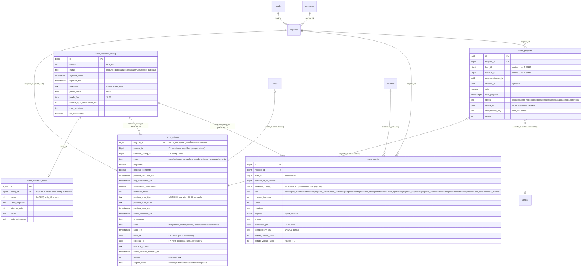

# 06 — Arquitetura persistente do CRM Nova Era (FASE 2.0 — DESENHO, nada aplicado)

> ⚠️ **SUPERSEDIDO EM PARTE PELA FASE 2.2.** Onde este documento divergir dos docs 14–20, prevalecem os 14–20. Em especial: `ncrm_estado` **não** guarda `corretor_id` nem `lead_id`; **não** há trigger de sincronização em `negocios`; a RLS lê a **posse atual** em `negocios` (doc 17); invariantes bidirecionais no doc 16; ordem transacional no doc 15; ciclo da proposta no doc 18; draft autoritativo `sql-drafts/DRAFT-FASE-2.2-modelo-persistente.sql`.

> Confronta o protótipo aprovado (`app/features/crm-nova-era/lib/rules.ts`, commit `103e773`)
> com o modelo real auditado no doc 05. DRAFT SQL correspondente em
> `sql-drafts/DRAFT-FASE-2.2-modelo-persistente.sql` (**DO NOT APPLY**).

> **Atualizado na Fase 2.1** (ver doc 13). Mudanças principais: entidade `ncrm_proposta`
> (proposta ≠ venda); snapshot sem `lead_id` denormalizado; config imutável (rascunho/publicada/
> encerrada); eventos com `workflow_config_id` FK e versões antes/depois; lógica em `ncrm_private`.

## 1. Princípios

1. **Nada é duplicado**: lead, telefone, corretor, negócio, conversa, visita e empreendimento
   permanecem nas tabelas atuais e são referenciados por FK. **Proposta** é entidade PRÓPRIA
   (`ncrm_proposta`) porque o "processo de proposta" não existe hoje sem virar venda (doc 13 §1).
2. **`negocios` não ganha colunas**: o estado operacional do Nova Era vive em tabela própria
   (1:1 com negócio), evitando repetir o padrão que espalhou o estado por `leads` (doc 05 §7.1).
3. **Snapshot + eventos**: leitura rápida em `ncrm_estado`; verdade histórica em `ncrm_evento`
   (append-only). O snapshot é 100% reconstruível por replay dos eventos.
4. **Toda escrita via RPC transacional** (contratos no doc 10) com `SECURITY DEFINER`,
   `search_path` fixo e guarda interna — lições da auditoria P0 (127 RPCs expostas, 3 sem
   search_path, funções sem guarda).
5. **Config versionada**: cadência/janela em `ncrm_workflow_config` + `ncrm_workflow_passo`;
   leads gravam a versão que os rege; mudar plano nunca reescreve histórico.

## 2. As peças e sua justificativa

| Peça | Tabela | Justifica-se porque… |
|---|---|---|
| A. Estado operacional | `ncrm_estado` | Quadro/fila precisam de UMA linha por negócio com etapa, próxima ação, prazos, flags — hoje isso exigiria juntar leads+negocios+vw_sla_leads+alertas (4 fontes, doc 05 §7.1) |
| B. Eventos imutáveis | `ncrm_evento` | Não existe evento tipado p/ tentativa/ação/automação; `crm_atividades` é texto livre com teto global de 500 (doc 05 §1) |
| C. Próxima ação | colunas em `ncrm_estado` (não tabela própria) | O protótipo provou que a próxima ação é escalar e única por negócio ("duas próximas ações simultâneas" é justamente o bug a impedir) — uma tabela N:1 reintroduziria o risco |
| D. Plano/passos de cadência | `ncrm_workflow_config` + `ncrm_workflow_passo` | Exigência de config por versão com vigência (spec §7); `PLANO_CADENCIA_PADRAO` do protótipo vira seed |
| E. Histórico de execuções | `ncrm_evento` + `workflow_config_id` FK no evento e no estado | Execuções são eventos; a versão usada fica gravada por FK (não em payload) no estado e em cada evento |
| F. Config/versionamento do workflow | `ncrm_workflow_config.versao/status/vigencia` | Troca de plano cria NOVA versão em rascunho→publicada; publicada é imutável; encerrada mantém FK |
| G. Proposta comercial | `ncrm_proposta` | Registrar proposta sem criar venda/ganho é impossível hoje (Esteira lê `vendas`); entidade própria isola o processo até a conversão real (doc 13 §1) |

Total: **5 tabelas novas** (`ncrm_workflow_config`, `ncrm_workflow_passo`, `ncrm_proposta`,
`ncrm_estado`, `ncrm_evento`) + schema `ncrm_private` para a lógica privilegiada.

## 3. Diagrama (Mermaid)

## 4. Mapeamento protótipo → banco

| Conceito do protótipo (`rules.ts`) | Persistência |
|---|---|
| `LeadNova.coluna` (4 etapas) | `ncrm_estado.etapa` (CHECK) + evento `mudanca_etapa` |
| `respondeu` / `respostaPendenteCorretor` / `primeira resposta` | `ncrm_estado.respondeu` / `.resposta_pendente` / `.primeira_resposta_em` + evento `resposta_cliente` |
| `mensagemAutomaticaEnviadaEm` / `aguardandoRespostaAutomacao` | `ncrm_estado.msg_automatica_em` / `.aguardando_automacao` + evento `mensagem_automatica` (idempotency = id do disparo) |
| `tentativas[]` (número, canal, resultado) | eventos `tentativa` (numero_tentativa, canal, resultado) + contador `tentativas_feitas` no estado |
| `acoesComerciais[]` | eventos `acao_comercial` (resultado = 10 valores da Fase 1.2; `payload.acao_prevista`) |
| `proximaAcao{Tipo,Titulo,Em}` | colunas homônimas em `ncrm_estado` (fonte da verdade do card/fila, como no protótipo) |
| `ultimaInteracaoEm`, `momento` (temperatura) | `ncrm_estado.ultima_interacao_em` / `.temperatura` |
| saídas visita/proposta/descarte/nutrição | `ncrm_estado.saida` + FKs `visita_id`/`proposta_id` (nunca `venda_id`) + eventos dedicados |
| `PLANO_CADENCIA_PADRAO` / `JANELA_OPERACIONAL_PADRAO` | seed de `ncrm_workflow_config` v1 + passos |
| funções puras (`aplicarTentativa`, `aplicarResultadoAcaoComercial`, …) | regras das RPCs transacionais (doc 10); o front continua usando as MESMAS funções puras para validação otimista |

## 5. Consistência snapshot × eventos

1. **Invariante**: toda mutação = 1 transação que (a) INSERE o evento, (b) ATUALIZA o estado com
   `versao = versao + 1` condicionado a `WHERE versao = p_versao_esperada`, (c) grava
   `estado_versao_apos` no evento. Se o UPDATE afetar 0 linhas → `ROLLBACK` + erro
   `versao_conflito` (o cliente reenvia com estado fresco).
2. **Nunca** se atualiza o snapshot sem evento; **nunca** se insere evento fora da transação.
   Isso é garantido concentrando a escrita nas RPCs (grants: tabelas sem INSERT/UPDATE direto
   para `authenticated` — apenas SELECT sob RLS; escrita só via RPCs `SECURITY DEFINER`).
3. **Replay**: `ncrm_evento` ordenado por `(negocio_id, id)` reconstrói o estado — usado no
   shadow (doc 11) para comparar snapshot recalculado × snapshot armazenado (paridade).
4. **Eventos imutáveis**: trigger `ncrm_evento_imutavel` bloqueia UPDATE/DELETE (proposta no
   draft); correções entram como novos eventos `correcao_manual` com `payload.corrige_evento_id`.
5. `crm_atividades` continua existindo para o CRM atual; o Nova Era **não** depende dela.

## 6. Concorrência e idempotência (spec §6)

| Ameaça | Proteção |
|---|---|
| Webhook repetido / resposta duplicada | `idempotency_key` UNIQUE parcial em `ncrm_evento` (ex.: `wa:<wa_message_id>`; disparo automático: `auto:<motor_execucao_id>`); INSERT ... ON CONFLICT DO NOTHING → RPC devolve `ja_processado` |
| Tentativa duplicada (duplo clique/reenvio) | idempotency do cliente `ui:<uuid-gerado-no-front>` + optimistic lock `versao` |
| Duas próximas ações simultâneas | próxima ação são COLUNAS do estado (não linhas) — a segunda escrita falha por `versao_conflito` |
| Movimento perdido (last-write-wins) | `versao` + `estado_versao_apos` no evento: nenhuma atualização sobrescreve outra sem ter lido a anterior |
| Visita criada 2× | RPC verifica visita futura existente do negócio antes de inserir em `visitas` (contrato 10.A); `negocio_id` já é PK do estado (não há índice parcial redundante — bloqueio 10) |
| Proposta criada 2× | `ncrm_proposta.idempotency_key` UNIQUE + índice único de proposta "viva" por negócio (`ux_ncrm_proposta_viva`) |
| Sara sobrescrever decisão humana | ver §7 |

## 7. Precedência Sara × humano

- Todo evento carrega `origem` (`usuario|automacao|sara|sistema|migracao`) e o estado guarda
  `ultima_decisao_humana_em` (atualizado quando `origem='usuario'` muda etapa/próxima ação/saída).
- **Regra**: RPCs chamadas com `origem='sara'` recebem `p_base_estado_em` (timestamp do estado
  que a Sara analisou). Se `ultima_decisao_humana_em > p_base_estado_em`, a RPC **não aplica** a
  mudança: registra apenas o evento `classificacao_sara` com `payload.aplicado=false` e devolve
  `precedencia_humana`. A sugestão fica auditável, nunca silenciosa.
- Sara nunca escreve nas tabelas diretamente (doc 08): apenas EXECUTE nas RPCs de sugestão.

## 8. Cadência configurável (spec §7)

- `ncrm_workflow_config`: `versao` (UNIQUE), `ativo`, `vigencia_inicio/fim`, `timezone`
  (default `America/Sao_Paulo`), `janela_inicio/fim` (default 09:30/18:00),
  `espera_apos_automacao_min`, `max_tentativas`.
- `ncrm_workflow_passo`: `ordem` (1..N, UNIQUE por config), `canal_sugerido`, `intervalo_min`,
  `rotulo`, `texto_orientacao`, `ativo`.
- **Imutabilidade (Fase 2.1)**: config tem `status` `rascunho|publicada|encerrada`. Só `rascunho`
  é editável (trigger bloqueia UPDATE de colunas de regra e DELETE de config publicada; passos de
  config publicada são imutáveis). Nova regra = NOVA versão em rascunho → publicar. No máximo UMA
  versão publicada vigente (índice único); vigências não se sobrepõem (EXCLUDE, extensão a avaliar).
- **Vigência**: publicar preenche `vigencia_inicio`; encerrar preenche `vigencia_fim`. Leads em
  andamento mantêm `ncrm_estado.workflow_config_id` antigo até regra de transição explícita
  (decisão 12.5). Histórico nunca é reescrito porque **cada evento referencia a config por FK
  `workflow_config_id` NOT NULL** (não por payload) e `ON DELETE RESTRICT` impede apagar config usada.
- **Extensão feriados** (não implementar agora): tabela futura `ncrm_dias_nao_operacionais(data, motivo)`
  consultada pela função de janela — ponto de extensão comentado no draft.

## 9. O que explicitamente NÃO entra nesta arquitetura

- Colunas novas em `leads`/`negocios`/`visitas`/`vendas`.
- Duplicação de conversa/telefone (WhatsApp continua em `wa_*`).
- Motor de disparo automático (continua no `motor_*`; o Nova Era só registra o evento).
- Substituição de `vw_sla_leads`/AttentionCenter do CRM atual (convivem durante o shadow).
